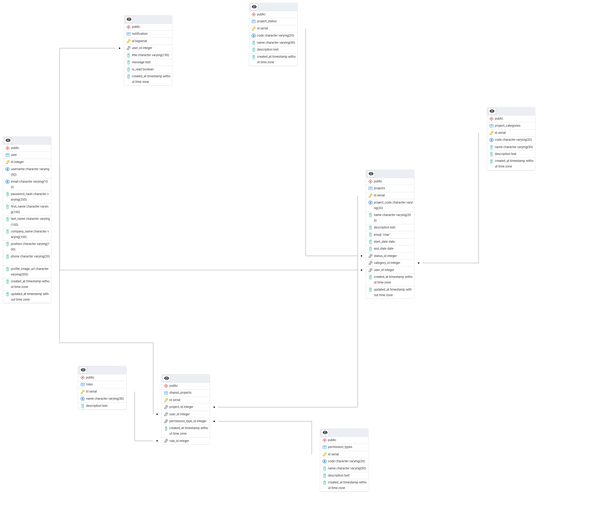

# demo-project

## 📊 Diagrama Entidad-Relación

## 💾 Script del Proyecto

## 🛠️ Errores / Mejoras pendientes

- [ ] Faltan implementar un campo de **registro** en la base de datos.
- [ ] No se debe permitir actualizar **email** o **teléfono** sin un proceso de verificación.
- [ ] En la **búsqueda avanzada** existe el campo **categoría**, pero al crear un proyecto no está disponible el campo **categoría** para insertar.
